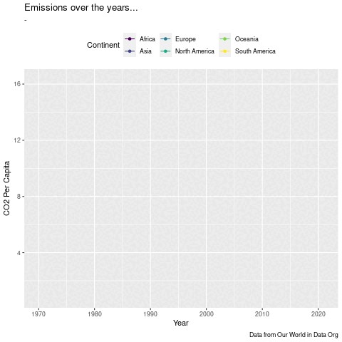

```{r setup, include=FALSE}
knitr::opts_chunk$set(echo = FALSE, warning=FALSE, message=FALSE, cache = TRUE, error = TRUE)
```

```{r, include=FALSE, error = TRUE}
knitr::opts_chunk$set(echo = TRUE)
library(kableExtra)
library(tidyverse)
library(ggplot2)
library(readr)
library(dplyr)
library(zoo)
library(ggridges)
library(countrycode)
library(lubridate)
library(ggplot2)
library(gganimate)
library(plotly)
library(readxl)
library(viridis)
```

# I. INTRODUCTION:

In recent years, carbon dioxide ($CO_2$), a molecule born from the combustion of fossil fuels, has become a silent yet potent threat to human life and the environment. As the primary greenhouse gas, $CO_2$ emissions play a crucial role in climate change, casting a long shadow of devastating consequences across the globe. Rising sea levels threaten coastal communities, the temperature reaches the highest in hundreds of years, wildfires rage across parched landscapes, and droughts cast long shadows across fertile lands. These are not isolated incidents, but rather the consequences of the rising carbon dioxide emissions caused by the demand for energy. In this article, we will navigate a sea of data, charting the course of emissions across diverse nations and continents, and uncovering the intricate connections between human activity and the shifting balance of our planet.

# II. DATASETS:

For this article, we used three datasets:

-   CO₂ Emissions Dataset (Source: [Our World In Data](https://ourworldindata.org/co2-dataset-sources "CO₂ emissions dataset: Our sources and methods"))

-   Climate-related Disaster Frequency (Source: [International Monetary Fund](https://climatedata.imf.org/datasets/b13b69ee0dde43a99c811f592af4e821/explore "Climate-related Disasters Frequency"))

-   NFBA 2023 Public Data (Source: [Global Footprint Network](https://www.footprintnetwork.org/licenses/public-data-package-free/ "National Footprint and Biocapacity Accounts 2023 Public Data Package"))

```{r}
# Source: Our World in Data
co2 <- readr::read_csv('~/Mscs 164 F23/Project/Fay & Luanga Project Folder/Fay_Luanga/owid-co2-data.csv')

# Codebook; Source: Our World in Data
codebook <-  readr::read_csv('~/Mscs 164 F23/Project/Fay & Luanga Project Folder/Fay_Luanga/owid-co2-codebook.csv')

# Climate Disaster Frequency Dataset
Climate_related_Disasters_Frequency <- read_csv("~/Mscs 164 F23/Project/Fay & Luanga Project Folder/Fay_Luanga/Climate-related_Disasters_Frequency.csv")
# Ecological Footprint Dataset

NFBA_2023_Public_Data_Package_1_0 <- read_excel("//home/rstudio/courses/2023-24-semester1-mscs-164/Project/Fay & Luanga Project Folder/Fay_Luanga/NFBA 2023 Public Data Package 1.0.xlsx", 
    sheet = "Country Results (2019)", range = "A23:AF206")

eco_footprint <- NFBA_2023_Public_Data_Package_1_0

```

For the first dataset, since it includes both data from nations and continents, we decided to split it into to a sub-dataset (**continent_co2** and **county_co2**) using filter(). We also used join() functions and parse_number to tidy the Climate Disasters dataset.

```{r}
# Here, we are trying to create a separate, cleaner dataset which includes just continents (and not states!!!). We are also filtering the data to be after 1970.

continent_co2 <- co2 |>
  filter(year >= 1970, country %in% c("Africa","Asia", "Europe", "South America", "North America", "Oceania")) |>
  select(-gdp)
```

```{r}
# Here, we are trying to create a separate, cleaner dataset which includes just states (and not continents!!!). We are also filtering the data to be after 1970.
country_co2 <- co2 |>
  filter(year >= 1970, !(country %in% c("Africa","Asia", "Europe", "South America", "North America", "Oceania")), 
         !is.na(iso_code))
```

```{r}
# Pivoting longer to make it suitable for viewing
disasters_long <- Climate_related_Disasters_Frequency |> 
  filter(Indicator == "Climate related disasters frequency, Number of Disasters: TOTAL") |>
  pivot_longer(
    cols = starts_with("F"), 
    names_to = "year", 
    values_to = "disasters") |>
  mutate_at("year", str_replace, "F", "") |>
  replace_na(list(disasters = 0)) |>
  mutate(iso_code = ISO3, year = parse_number(year)) |>
  select(year, iso_code, disasters) 
```

We also utilized the ***countrycode*** package to get the ISO Code and the official names of nations and continents.

```{r}
# Converting country ISO Codes to a country name, or to designate a region for it. This is where the country code library help us out!

disasters_long$continent <- countrycode(sourcevar = disasters_long$iso_code,
                             origin = "iso3c",
                             destination = "un.region.name")
disasters_long$country <- countrycode(sourcevar = disasters_long$iso_code,
                             origin = "iso3c",
                             destination = "iso.name.en")
country_co2$region <- countrycode(sourcevar = country_co2$iso_code,
                             origin = "iso3c",
                             destination = "un.region.name")

eco_footprint$continent <- countrycode(sourcevar = eco_footprint$Country,
                             origin = "country.name",
                             destination = "un.region.name")
```

```{r}
disasters_long <- disasters_long |>
  mutate(country = fct_recode(country, "United States" = "United States of America (the)", "Philippines" = "Philippines (the)", "Vietnam" = "Viet Nam"))
```

```{r}
#Extra tidying for ecological footprint
eco_footprint <- eco_footprint |>
  mutate(eco_decifit = `Ecological (Deficit) or Reserve`)
```

# III. QUESTIONS:

### 1. Which countries emitted the most $CO_2$ from 1970 to 2021?

```{r}
top10_country <- country_co2 |>
  filter(year == 2021) |>
  slice_max(cumulative_co2_including_luc, n = 10) |>
  mutate(ranking = row_number()) |>
  tibble("top_country" = country, "rank" = ranking) |>
  select(top_country, rank)
```

```{r,error =TRUE, fig.alt = 'Stacked area chart illustrating the distribution of each CO2 sources with facets for each country. On X axis is year (range: 1970 - 2020) and y axis is carbon dioxide emissions (0 - 120 hundreds of millions tonnes). USA and China have the highest cummulative of CO2 emission up to 2021. Most of the CO2 emission was contributed from coal, gas, land use, and oil.', out.width="100%",out.height = "90%", fig.cap = "Fig 1. A plot of Top 10 Countries with The Highest Carbon Dioxide Emission (updated at 2021)"}

country_co2 |> 
  right_join(top10_country, join_by(country == top_country)) |>
  select(country,
         year, 
         cement_co2, 
         coal_co2, 
         flaring_co2, 
         gas_co2, 
         land_use_change_co2,
         oil_co2, 
         other_industry_co2) |>
  replace_na(list(other_industry_co2 = 0)) |>
  mutate(country = fct_relevel(country, "United States", "China", "Russia", "Brazil", "India", "Germany", "Indonesia", "United Kingdom", "Canada", "Japan"),
         across(cement_co2:other_industry_co2)/100) |>
  pivot_longer(cement_co2:other_industry_co2, names_to = "co2_sources", values_to = "value") |>
  mutate(co2_sources = fct_recode(co2_sources, 
                                  "Coal" = "coal_co2",
                                  "Flaring" = "flaring_co2",
                                  "Cement" = "cement_co2",
                                  "Gas" = "gas_co2",
                                  "Land Use" = "land_use_change_co2",
                                  "Oil" = "oil_co2",
                                  "Other industry" = "other_industry_co2")) |>
  ggplot(aes(x=year, 
                  y=value, 
                  fill=fct_reorder2(co2_sources, value, year))) +
  geom_area() +
  facet_wrap(~country) +
  theme_classic() +
  theme(legend.position = "top")+
  scale_x_continuous(breaks=seq(1970,2020,20))+
  scale_fill_viridis(discrete=TRUE)+
  labs(title = "Carbon Dioxide Source Profiles of Top Emitting Nations\n(1970-2021)", x = "Year", y = "Carbon Dioxide Emission (hundreds of  million tonnes)", fill = "Sources", caption = "Source: Global Carbon Budget (2022)") 
```

+----------------+---------------+---------------------+
| Country        | Rank          | Primary Source 2021 |
+================+===============+=====================+
| United States  | 1             | Oil                 |
+----------------+---------------+---------------------+
| China          | 2             | Coal                |
+----------------+---------------+---------------------+
| Russia         | 3             | Gas                 |
+----------------+---------------+---------------------+
| Brazil         | 4             | Land Use            |
+----------------+---------------+---------------------+
| India          | 5             | Coal                |
+----------------+---------------+---------------------+
| Germany        | 6             | Coal                |
+----------------+---------------+---------------------+
| Indonesia      | 7             | Land Use            |
+----------------+---------------+---------------------+
| United Kingdom | 8             | Gas                 |
+----------------+---------------+---------------------+
| Canada         | 9             | Oil                 |
+----------------+---------------+---------------------+
| Japan          | 10            | Coal                |
+----------------+---------------+---------------------+

: Table 1.Top 10 emitting countries (1970 - 2021)

According to the plot, industry-heavy countries, led by the United States and China, contribute the world's share of global $CO_2$ emissions, with China's contribution experiencing a rapid rise after 2000, nearly doubling its previous output. Coal, land use, and oil remain the dominant sources. This alarming trend highlights the critical need for collective action from major emitters, including transitioning to cleaner energy sources and implementing sustainable practices, to mitigate further climate change impacts.

Wealthy countries, particularly the United States, have emitted the lion's share of greenhouse gases that led to the climate crisis. However, it is important to note that contemporary observations reveal the involvement of certain developing nations in this global environmental challenge.

Since the onset of the Industrial Revolution in the 18th century, human activities have raised atmospheric $CO_2$ by 50%[^1]. Combining this fact with the graphs above, we can reinforce the correlation that human-induced carbon emissions, particularly from industrialized activities, have played a pivotal role in altering the composition of the Earth's atmosphere, contributing significantly to the current climate challenges we face.

[^1]: <https://climate.nasa.gov/vital-signs/carbon-dioxide/#:~:text=Since%20the%20onset%20of%20industrial,ice%20age%2020%2C000%20years%20ago.>

### 2. Which countries suffered the most climate-related disasters?

```{r,error =TRUE}
top10_disaster_country <-
  disasters_long |>
  group_by(iso_code) |>
  summarize(sum_disaster = sum(disasters)) |>
  slice_max(sum_disaster, n = 10)
```

```{r,error =TRUE}
top_10_disasters <- country_co2 |> 
  semi_join(top10_disaster_country, join_by(iso_code)) |>
  select(country,
         year, 
         cement_co2, 
         coal_co2, 
         flaring_co2, 
         gas_co2, 
         land_use_change_co2,
         oil_co2, 
         other_industry_co2,
         co2_including_luc) |>
  mutate(across(cement_co2:co2_including_luc)/100,
         country = fct_relevel(country, "United States", "China", "India", "Philippines", "Indonesia", "Bangladesh", "Vietnam", "Mexico", "Brazil", "Japan")) |>
  replace_na(list(other_industry_co2 = 0)) |>
  pivot_longer(cement_co2:other_industry_co2, names_to = "co2_sources", values_to = "value") |>
  mutate(co2_sources = fct_recode(co2_sources, 
                                  "Coal" = "coal_co2",
                                  "Flaring" = "flaring_co2",
                                  "Cement" = "cement_co2",
                                  "Gas" = "gas_co2",
                                  "Land Use" = "land_use_change_co2",
                                  "Oil" = "oil_co2",
                                  "Other industry" = "other_industry_co2")) 
```

```{r, fig.alt = 'Dual-axis line and stacked area chart divided into panels for each country in the top 10 for disaster occurrences. Each area represents a different source of CO2 emissions (color-coded) with the red line showing the trend of number of disasters for each country over time. On X axis is year (range: 1970 - 2020), left y-axis is carbon dioxide emissions (0 - 120 hundreds of millions tonnes), and right y-axis is number of disasters.', out.width="100%",out.height = "90%", fig.cap = "Fig 2. A plot of Top 10 Countries Most Affected by Climate-related Disasters(updated at 2021)"}
top_10_disasters |> 
    ggplot(aes(x = year)) +
    geom_area(aes(y=value, 
                  fill=fct_reorder2(co2_sources, value, desc(year)))) +
    facet_wrap(~country) +
    theme_classic() +
    geom_smooth(data = disasters_long |> semi_join(top10_disaster_country),
             aes(x = year, y = disasters),
             color = "red",  
             size = 0.5,
             se = FALSE) +      
  theme_classic() +
  theme(legend.position = "top")+
  scale_y_continuous(
    name = "Carbon Dioxide Emission (hundreds of  million tonnes)",
    sec.axis = sec_axis(~., name = "Number of Disasters", breaks = seq(0, 200, 50))
  ) +
  scale_x_continuous(breaks=seq(1970,2020,20))+
  scale_fill_viridis(discrete=TRUE) +
  labs(title = "Distribution of CO2 Emission Sources in Top Disaster-Prone Countries\n(1970-2021)", x = "Year", fill = "Sources", caption = "Source: Global Carbon Budget (2022)\nThe Emergency Events Database (EM-DAT)")

```

+---------------+--------------+
| Country       | Rank         |
+===============+==============+
| United States | 1            |
+---------------+--------------+
| China         | 2            |
+---------------+--------------+
| India         | 3            |
+---------------+--------------+
| Philippines   | 4            |
+---------------+--------------+
| Indonesia     | 5            |
+---------------+--------------+
| Bangladesh    | 6            |
+---------------+--------------+
| Vietnam       | 7            |
+---------------+--------------+
| Mexico        | 8            |
+---------------+--------------+
| Brazil        | 9            |
+---------------+--------------+
| Japan         | 10           |
+---------------+--------------+

: Table 2. Top 10 Countries Affected By Climate-Related Countries

We see many familiar nations here (United States, China, India, Indonesia, Brazil, and Japan) but there are four seemingly "innocent" countries whose $CO_2$ contributions are relatively negligible compared to other nations. Despite their lower carbon footprint, these countries bear a disproportionately high impact from climate-related disasters. What these nations---Vietnam (proximate to China), the Philippines (sharing the same sea area with Indonesia), Bangladesh (adjacent to India), and Mexico (bordering the United States)---have in common is their geographical proximity to major industrial nations. Additionally, all four countries rank among the top 20 most populated nations globally.

Another noticeable pattern we realized from the plot is the proportional relationship between the number of climate-related disasters and carbon dioxide emissions. Specifically, as carbon dioxide emissions increased, there was a corresponding rise in the frequency of climate-related disasters. This correlation suggests a potential link between escalating emissions and the heightened occurrence of environmental disasters, underlining the connections of human activities and their impact on the climate.\

### 3. Which countries have the best and worst ecological footprints?

Ecological footprints are a measure that takes into account an individual or country's usage of nature and biocapacity.[^2]

[^2]: <https://www.footprintnetwork.org/our-work/ecological-footprint/>

That means that if my neighborhood is constantly churning out pollutants into the air and cutting up our green spaces to put in new buildings, I will have a high eco-footprint. If my neighbourhood is churning out pollutants into the air but keeping the green spaces, my ecological footprint will be bad but not horrible. If my neighbourhood uses clean energy, maintains (and even adds!) to its green spaces, it has a great ecological footprint, and might even have an ecological *reserve* instead of a deficit.

We can scale up this concept to countries! So we decided to take a look at the Top 10 worst ecological footprints and the Top 10 best ecological footprints. We filtered the data so that it used a *per-capita* measure. This is a targeted universalist approach as it means that it takes into account population sizes of countries.

#### a. Top 10 Highest Eco Footprint Deficit ❌

```{r,error =TRUE, fig.alt = 'Stacked area chart illustrating the distribution of each CO2 sources with facets for each country. On X axis is year (range: 1970 - 2020) and y axis is carbon dioxide emissions (0 - 120 hundreds of millions tonnes). USA and China have the highest cummulative of CO2 emission up to 2021. Most of the CO2 emission was contributed from coal, gas, land use, and oil.', out.width="100%", fig.cap = "Fig 3. A plot of Top 10 Countries with The Highest Ecological Footprint (updated to 2021)"}

eco_footprint |>
  group_by(Country) |>
  summarize(eco_decifit, continent) |>
  slice_min(eco_decifit, n = 10) |>
  mutate("rank" = row_number()) |>
  ggplot(aes(x=fct_reorder2(Country, Country, rank, .desc = FALSE),y=eco_decifit, fill=fct_reorder2(continent, Country, rank), text = paste(Country, eco_decifit))) +
  geom_bar(stat="identity") +
  theme_classic() +
  labs(title = "Room to Improve..", subtitle = "Top 10 countries with biggest ecological decifit", alt ="aa", x = "Country", y = "Ecological Decifit (gha)", fill = "Continent", caption = "Source: Global Footprint Centre") 

ggplotly(tooltip="text")
```

#### b. Top 10 Highest Eco-Footprint Reserves ✅

```{r,error =TRUE, , fig.alt = 'Stacked area chart illustrating the distribution of each CO2 sources with facets for each country. On X axis is year (range: 1970 - 2020) and y axis is carbon dioxide emissions (0 - 120 hundreds of millions tonnes). USA and China have the highest cummulative of CO2 emission up to 2021. Most of the CO2 emission was contributed from coal, gas, land use, and oil.', out.width="100%", fig.cap = "Fig 4. A plot of Top 10 Countries with The Lowest Ecological Footprint (updated to 2021)"}

eco_footprint |>
  group_by(Country) |>
  summarize(eco_decifit, continent) |>
  slice_max(eco_decifit, n = 10) |>
  mutate("rank" = row_number()) |>
  ggplot(aes(x=fct_reorder2(Country, Country, rank, .desc = FALSE),y=eco_decifit, fill=fct_reorder2(continent, Country, rank), text = paste(Country, eco_decifit))) +
  geom_bar(stat="identity") +
  theme_classic() +
  labs(title = "The Lowest Net Ecological Decifits", alt ="aa", x = "Country", y = "Ecological Decifit ((gha)", fill = "Continent", caption = "Source: Global Footprint Centre") 

ggplotly(tooltip="text")
```

We thought: *why just remain looking at countries?*

We can also zoom out and look at climate heroes and zeros on a continental scale!

### 4. How has Climate Change evolved on a continental level since 1990?

```{r}
#This is out animated graph over here:
```



### 5. Which continents have contributed the most to CO2 emissions since 1990?

Variable: co2_per_capita

```{r, fig.alt = 'Stacked bar chart illustrating the distribution of the share of CO2 sources for each continent per year since 1970. On y axis is year (range: 1970 - 2020) and x axis is carbon dioxide emissions (as a % of global value). North America contributes the most.', out.width="100%", fig.cap = "Fig 5. A plot of the share of each continent's contribution to global CO2 emissions since 1970 (updated to 2021)"}

continent_co2 |>
  filter(year >= 1970, !is.na(co2_per_capita)) |>
  ggplot() +
  geom_col(aes(x = year, y = co2_per_capita, fill = country), position = "fill") +
  coord_flip() + 
  labs(title = "Contribution to Climate Change by Continent", caption = "Data from ourworldindata.com", x = "Year", y = "CO2 Per Capita (% of global)", fill = "Continent")
  
```

The graph demonstrates that we can see that Oceania, Europe and the Americas have contributed the most to Climate Change since the 1970s, with no real change in the shares of each continents contribution?

So now, which continents suffer the most from Climate Change related disasters?

### 6. Which continents have suffered the most climate related diasasters since 1990?

```{r, fig.alt = 'Stacked area chart illustrating the distribution of each CO2 sources with facets for each country. On X axis is year (range: 1970 - 2020) and y axis is carbon dioxide emissions (0 - 120 hundreds of millions tonnes). USA and China have the highest cummulative of CO2 emission up to 2021. Most of the CO2 emission was contributed from coal, gas, land use, and oil.', out.width="100%", fig.cap = "Fig 6. A plot of the share of each continent's share of climate disasters since 1990 (updated to 2021)"}
disasters_long |>
  filter(year >= 1990) |>
  ggplot() +
  geom_col(aes(x = year, y = disasters, fill = continent), position = "fill") +
  coord_flip() + 
  labs(title = "Sufferors of Climate Change by Continent", caption = "Data from ourworldindata.com", x = "Year", y = "Share of Climate Related Disasters", fill = "Continent")
  
```

Africa and Asia's proportions increase **drastically** when it comes to climate related stress and disasers. This is despite having minimally low contributions to the emissions of carbon dioxide as a whole. This highlights how even on a continental level, there are still disproportionate impacts on the heroes of climate change.

### 7. Summing this all up, what can population, carbon emissions and GDP of a country/continent tell us about ecological footprint?

*This is a Static / Interactive Plot*

```{r, error = TRUE, fig.alt = 'Scatter graph illustrating the CO2 per GDP for countries around the world vs population. On X axis is population (range: 1 million to 1 billion) and y axis is CO2 per GDP (0.0 to 1.2). USA and China have the highest cummulative of CO2 emission up to 2021. On the secondary axis, the dots of each country are coloured according to their continent. There is no real trend. Congo has the lowest CO2 per GDP', out.width="100%", fig.cap = "Fig 6. A plot of each country's CO2 emissions per GDP amount and their population in 2018 (updated to 2021)"}
country_co2 |>
  filter(year == 2018, !is.na(region)) |>
ggplot(aes(population, co2_per_gdp, colour = region, text = paste(country))) +
  geom_point() +
  theme_bw() +
  labs(title = "Population, Carbon and GDP", x = "Population", y="Annual CO2 Emissions per GDP $", colour = "Continent", caption = "Source: Our World in Data 2022") 
  
  ggplotly(tooltip="text")
```

There is no real trend when it comes to population and a country's CO2 per GDP dollar unit. We thought this would be interesting to explore as it could perhaps lead us to another insight (If there is a relationship between population and your emissions vs GDP output). What this shows is that even if you have a large population, it doesn't really increase how much emissions you use vs your GDP.

# IV. CONCLUSION:

From our brief exploration, we could begin to identify some Climate Heroes and Zeroes. It confirms what we thought: Climate Change identifies the Global South disproportionately (Mishra, S.K., Upadhyaya, P., Fasullo, J.T. *et al*, 2013) [^3]

[^3]: Mishra, S.K., Upadhyaya, P., Fasullo, J.T. *et al.* A need for actionable climate projections across the Global South. *Nat. Clim. Chang.* **13**, 883--886 (2023). <https://doi.org/10.1038/s41558-023-01778-2>

States like Bangladesh or, at a continental level, continents like Africa clearly have minimal to do with causing global warming thanks to their CO2 emissions, yet they have the most amount of disasters.

COP28 just concluded (as of 14 December), and yet no significant funding or compensation mechanism was agreed for developing countries (The Guardian, 2023)[^4]

[^4]: <https://www.theguardian.com/environment/2023/dec/13/what-the-cop28-agreement-says-and-what-it-means>

Higher income, island nations and even higher income large nations (like the USA) need to do more to become more of Climate Heroes, or the history books might just relegate them to the depths of zeroes.

# V. Appendix:

Here is the code that we utilized to make an ANIMATED PLOT. We commented it out and exported the image as a GIF to then re-insert into our RMD.

How country CO2 emissions and GDP has changed over time.

`ggplot(continent_co2,`

`aes(x = co2, y=co2_per_capita, size = population, colour = country)   ) +   geom_point(show.legend = TRUE, alpha = 0.7) +   scale_color_viridis_d() +   scale_size(range = c(2, 12)) +   scale_x_log10() +   labs(x = "CO2 emissions", y = "CO2 per capita") + transition_time(year) +   labs(title = "Year: {frame_time}")` with facet wraps (ignore) \#`{r} ggplot(   continent_co2,    aes(x = co2, y=co2_per_capita, size = population, colour = country)   ) +   geom_point(show.legend = TRUE, alpha = 0.7) +   scale_color_viridis_d() +   scale_size(range = c(2, 12)) +   scale_x_log10() +   labs(x = "CO2 emissions", y = "CO2 per capita") +   facet_wrap(~country) + transition_time(year) +   labs(title = "Year: {frame_time}")`

\#`{r}  ggplot(continent_co2,           aes(year, co2_per_capita, group = country, color = factor(country))   ) +      geom_line() +   scale_color_viridis_d() +      labs(x = "Year", y = "CO2 Per Capita", color = "Continent", subtitle = "-", title = "Emissions over the years...", caption = "Data from Our World in Data Org" ) +      theme(legend.position = "top") +      geom_point(aes(group = seq_along(year))) +    transition_reveal(year) #`
